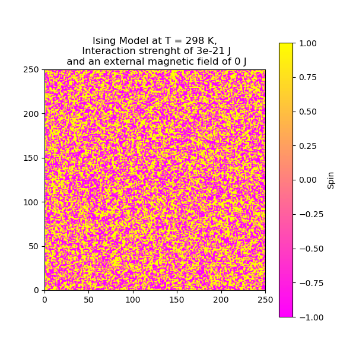

# Ising Model Simulator 🎲

This repository contains a Python implementation of an Ising Model simulator. The simulation is based on the Monte Carlo method and uses the Metropolis algorithm with the Maxwell-Boltzmann distribution to study the statistical mechanics of a 2D spin system. The core functionality is implemented in the `IsingModelClass`.

<p align="center">
	
</p>

## Features ✨
- Implements the Ising Model in two dimensions using a Python class.
- Utilizes the Metropolis algorithm for state evolution.
- Configurable simulation parameters such as lattice size, temperature, coupling strength (J), and external magnetic field (h).
- Visualizes spin configurations, magnetization, and energy evolution with the possibility of saving animations and changing colormaps.

## Requirements 📋
To run this simulator, you need:

- Python (>=3.7)
- Jupyter notebook
- NumPy
- Matplotlib

You can install the required packages using pip:
```bash
pip install numpy matplotlib
```

## Getting Started 🚀
1. Clone the repository:
	```bash
	git clone https://github.com/CarlosGarciaSanchez19/IsingModelSimulator.git
	cd IsingModelSimulator
	```

2. Open the Jupyter Notebook:
	```bash
	jupyter notebook SimulationExample.ipynb
	```

3. Configure the parameters (e.g., lattice size, temperature) in the notebook and run the cell.

## Usage 🛠️
### Configurable Parameters ⚙️
The `IsingModelClass` allows you to configure the following parameters:
- **Lattice Size**: Size of the spin lattice (e.g., 20x20, 50x50).
- **Temperature**: Temperature of the system, affecting spin interactions.
- **Interaction Strength (J)**: Coupling constant representing spin-spin interactions.
- **External Magnetic Field (h)**: Strength of the external magnetic field.

### Methods 📚
- `reset_model()`: Resets the spin lattice to a random state.
- `calc_energy()`: Calculates the system's energy after a random spin flip.
- `calc_curie_temperature()`: Calculates the Curie temperature for the model.
- `simulate(steps)`: Runs the simulation for a specified number of steps and records magnetization.
- `animate(steps, file_name)`: Creates an animation of the spin dynamics.
- `plot_energy(steps)`: Plots the system's energy over Monte Carlo steps.
- `plot_magnetization(steps)`: Plots the magnetization over Monte Carlo steps and displays the final spin configuration.

### Example Usage 💻
Below is an example of how to use the `IsingModelClass` programmatically:
```python
from IsingModel import IsingModelClass

# Initialize the model
model = IsingModelClass(size=20, temperature=50, J=3e-21, h=5e-22)
print(model)

# Animate the spin dynamics
model.animate(steps=10000, file_name="ising_simulation", cmap="gray")

# Simulate and plot magnetization
model.plot_magnetization(steps=10000, cmap="coolwarm")

# Simulate and plot system's energy
model.plot_energy(steps=10000, cmap="viridis")
```

## Files 📁
- `IsingModelSimulation.ipynb`: Jupyter Notebook with simulation and visualization examples.
- `IsingModel.py`: Python script containing the `IsingModelClass` implementation.
- `SimulationExample`: Folder with example simulation results.

## Example Output 📊
The simulator provides:
- **Magnetization Plot**: Tracks the system's magnetization over Monte Carlo steps.
- **System's energy plot**: Tracks the system's energy over Monte Carlo steps.
- **Spin Configuration**: Visualization of the final lattice state.
- **Animations**: Dynamic visualizations of spin evolution over time.

## References 📚
- https://en.wikipedia.org/wiki/Ising_model

## License 📜
This project is licensed under the Apache License 2.0. See the [LICENSE](LICENSE) file for details.

## Acknowledgements 🙏
Special thanks to the open-source community for the tools and libraries that made this project possible.

